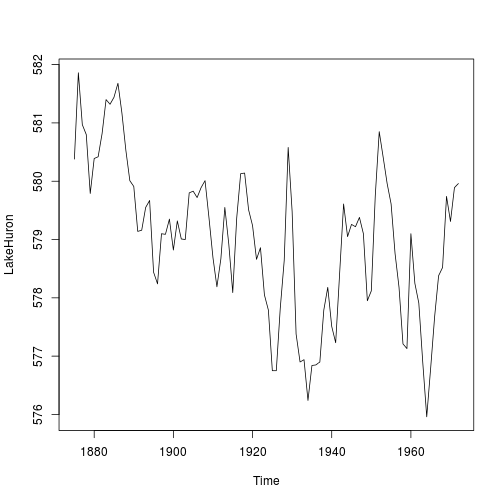
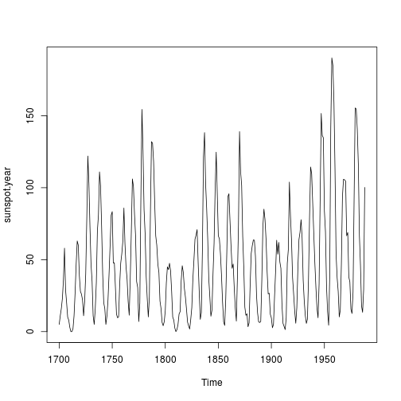

EarthQuest Tool
========================================================
author: Steven Strand
date: 3/19/2015
transition: linear

* Tool Features
  * View Earth-Centric Time Series DataSets in R Base
  * Interactively view correlations
  
  * GitHub Repository for Source: [http://github.com/srscello/create-data-products.git](http://github.com/srscello/create-data-products.git)

Data Sets in R of Interest
========================================================
transition: rotate

* LakeHuron
  * Annual measurements of the level, in feet, of Lake Huron 1875–1972
* Sunspot.year
  * Yearly numbers of sunspots from 1700 to 1988 (rounded to one digit).

LakeHuron
========================================================

```r
plot(LakeHuron)
```



Sunspot.year
========================================================

```r
plot(sunspot.year)
```



Connecting the Datasets
========================================================

* Use an interactive tool to explore data on the same time scale
* Explore interactions between datasets
* Find out whether data are correlated, find a model & the significance level
