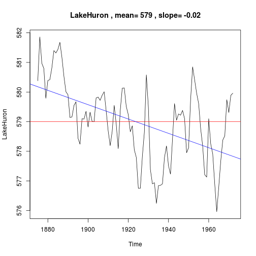

EarthQuest Tool
========================================================
author: Steven Strand
date: 4/9/2016
transition: linear

* Tool Features
  * View Earth-Centric Time Series DataSets in R Base
  * Interactively view correlations
  * GitHub Repository for Source: [http://github.com/srscello/create-data-products.git](http://github.com/srscello/create-data-products.git)
  * Link to run EarthQuest Tool:
  [https://srscello.shinyapps.io/shinyapp/](https://srscello.shinyapps.io/shinyapp/)

Data Sets in R of Interest
========================================================
transition: rotate

* LakeHuron: Annual measurements of the level, in feet, of Lake Huron 1875–1972
* sunspot.year: Yearly numbers of sunspots from 1700 to 1988 (rounded to one digit).
* co2: Mauna Loa Atmospheric CO2 Concentration
* nhtemp: Average Yearly Temperatures in New Haven
* treering: Yearly Treering Data, -6000-1979

Plot showing LakeHuron Time Series
========================================================

Interesting Tool Features
========================================================
* Plot a single time series
* Plot two time series above each other, with common time window if desired
* Cross-plot one time series against another and report $R^2$ value for a linear regression

Tool Screenshot
=================================
* The following screen shot illustrates the interactive features of the EarthQuest tool
* The application is easy to use and fun!
* Try Earthquest to learn more about data sets in R and some history of our planet

